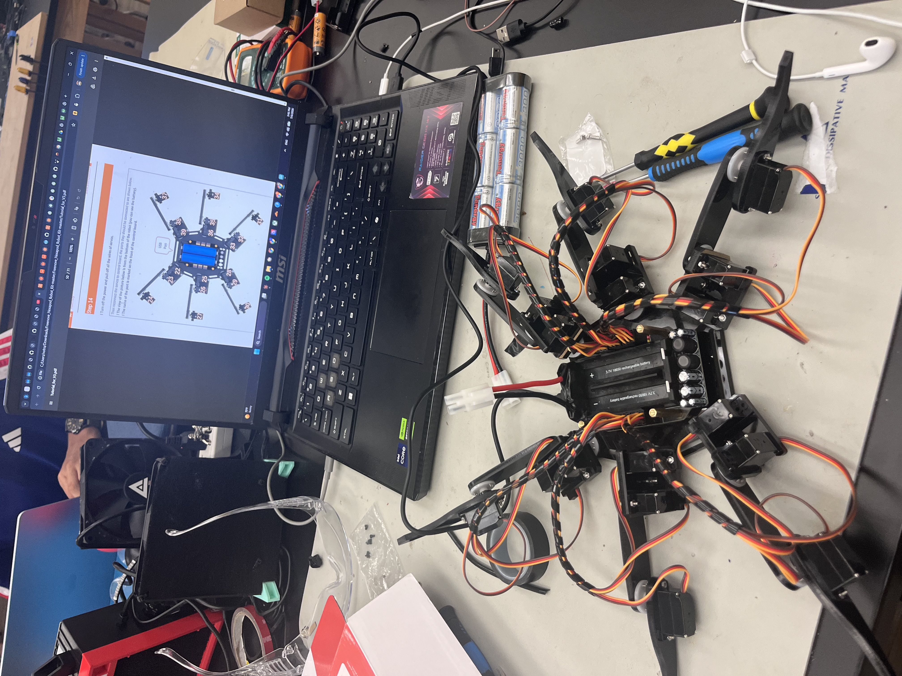
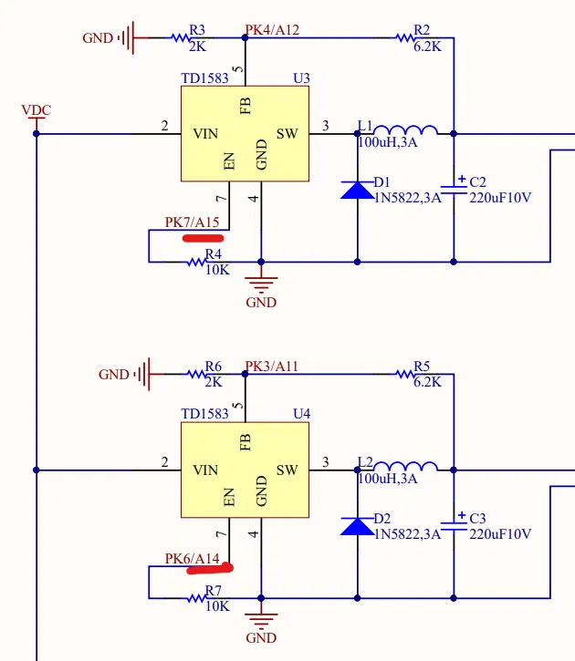
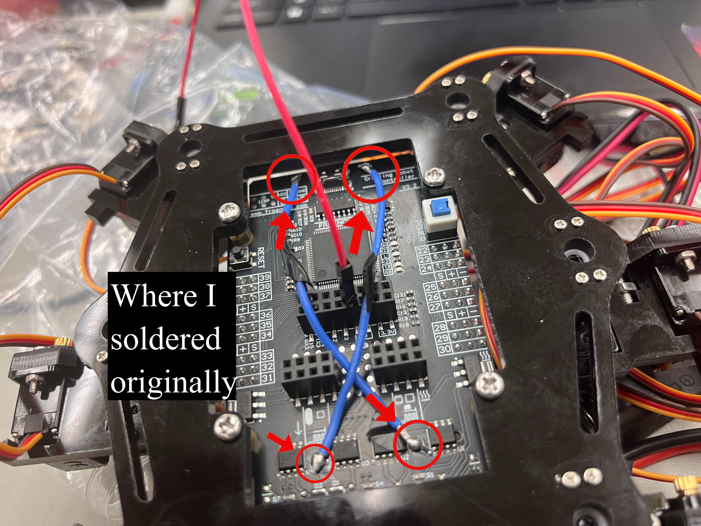
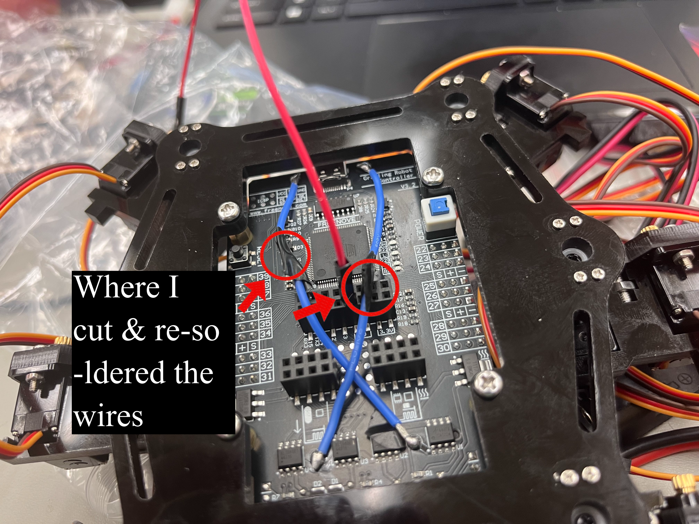

# My Hexapod Robot project.
<!--
 Replace this text with a brief description (2-3 sentences) of your project. This description should draw the reader in and make them interested in what you've built. You can include what the biggest challenges, takeaways, and triumphs from completing the project were. As you complete your portfolio, remember your audience is less familiar than you are with all that your project entails!


You should comment out all portions of your portfolio that you have not completed yet, as well as any instructions:
 
<!--- This is an HTML comment in Markdown -->
<!--- Anything between these symbols will not render on the published site -->


| **Engineer** | **School** | **Area of Interest** | **Grade** |
|:--:|:--:|:--:|:--:|
| Raghav V | Princeton Day School | ~ | Incoming Junior

# Final Milestone

**[Replace with your final milestone video embedding]**

<!-- <iframe width="560" height="315" src="YOUR_VIDEO_URL_HERE" title="Raghav V. Final Milestone" frameborder="0" allow="accelerometer; autoplay; clipboard-write; encrypted-media; gyroscope; picture-in-picture; web-share" referrerpolicy="strict-origin-when-cross-origin" allowfullscreen></iframe> -->

My final milestone brought together everything: a fully functional hexapod with a secure battery mount and two modifications that extend its capabilities beyond basic walking.

**What I accomplished since Milestone 2:**

*Milestone 3 — Battery Mount:*
I designed and 3D-printed a custom battery holder for the Tenergy 7.2V NiMH pack. The first version was off by about 2 cm in width, so I went back into the CAD, pulled dimensions directly from the hexapod's DXF files instead of estimating, and printed v2. That one fit. The battery now sits securely on the chassis instead of dangling off wires, which cleaned up the whole build and made the robot more stable and portable.

*Modification 1 — Ultrasonic Sensor for Obstacle Detection:*
I added an HC-SR04 ultrasonic sensor to the front of the hexapod so it can detect obstacles. I designed and printed a mount for the sensor, wired it to the controller, and wrote code to read distance measurements. The challenge was integrating this with the remote control — I had to understand how the bot was receiving IR signals from the remote without using the default library, so I wrote my own receiver logic that could handle both remote commands and sensor input simultaneously. I also implemented a rolling average filter to smooth out noisy readings, which made the obstacle detection more reliable (though slightly less responsive).

*Modification 2 — OLED Display:*
I mounted a GME 12864-13 OLED screen to display real-time status information like sensor readings, gait state, or battery status. Getting the display working required learning a new library and figuring out how to refresh the screen without slowing down the main control loop.

**Biggest challenges and triumphs at BSE:**

- **The servo power issue (Week 1):** Spending days debugging why servos wouldn't respond, only to discover I needed to enable two buck converters by writing HIGH to pins A14 and A15. That forced me to actually read the schematic instead of guessing, and it paid off.
- **Calibration (ongoing):** I recalibrated the servos three times. Small offsets that looked fine in a stand pose would cause the bot to lurch or drag a leg when walking. I learned that calibration isn't a one-time task — you revisit it whenever behavior doesn't match commands.
- **Working within vs. building from scratch:** I debated whether to use the FNHR library or write my own inverse kinematics. I chose to use the library, but only after reading through it to understand what each function was doing. That turned out to be the right call — understanding existing code is a real skill, and sometimes more efficient than reinventing it.
- **CAD iteration:** When my first battery mount didn't fit, I didn't get frustrated — I went back, found the actual dimensions from the DXF files, and printed v2. Work smarter, not harder.

**Key topics I learned:**

- How to read schematics to debug hardware (buck converters, enable pins).
- Servo calibration and the math behind mirrored joints (writing `180 − θ` for symmetric motion).
- Working with libraries: reading unfamiliar code, understanding it, then using it effectively.
- Sensor integration and signal filtering (rolling averages for the ultrasonic sensor).
- IR communication and how to decode remote signals without the default library.
- CAD design iteration and the value of using reference files instead of guessing dimensions.
- Soldering and desoldering on populated boards without damaging nearby components.

**What I hope to learn next:**

I want to dive deeper into computer vision and autonomous navigation. The ultrasonic sensor is a start, but adding a camera and implementing object recognition or SLAM (simultaneous localization and mapping) would be the next big step. I'm also curious about more advanced gait algorithms — maybe implementing a wave gait or adaptive gaits that respond to terrain. And honestly, I'd like to revisit inverse kinematics from scratch now that I understand the problem better, just to prove to myself I can do it.

This project taught me that hardware is messy, calibration is never done, and sometimes the best move is to understand and use what's already there instead of building everything yourself. I'm leaving BSE with a walking, obstacle-avoiding hexapod and the confidence to tackle whatever robotics project comes next.

# Second Milestone
<iframe width="560" height="315" src="https://www.youtube.com/embed/LdXhoI_4gq4" title="Raghav V. Milestone 2" frameborder="0" allow="accelerometer; autoplay; clipboard-write; encrypted-media; gyroscope; picture-in-picture; web-share" referrerpolicy="strict-origin-when-cross-origin" allowfullscreen></iframe>

My second milestone is getting the hexapod to walk using a tripod gait, and controlling its movement with a remote. 
In a tripod gait, three legs stay planted while the other set of three lift, swing forward, and set down, so at any moment the robot is a stable tripod. 
Which is why it's called a tripod gait.
Doing that with 18 servos means every joint has to hit its commanded angle at the right time, or the body lurches instead of walking.

Since Milestone 1, I've moved from a  stand pose to coordinated motion across all six legs, layered remote control on top of it, and recalibrated the servos over and over until the gait actually looked like walking.

For the gait and inverse kinematics I used the FNHR library that ships with the kit. I went back and forth on this in my notes, since writing Inverse Kinematics from scratch felt more handa on, but the library is a lot of code and the more useful exercise turned out to be reading through it until I understood what each function was doing and how to drive the robot with it, rather than reinventing code that was already there. 

The hardest part of this milestone was calibration. I calibrated the servos, tried to walk, watched a leg drag or the body tilt, and went back to recalibrate. I did this several times. A few things I learned the slow way:

- A servo written to 90° isn't always at 90° until you make sure it is, every servo needs its own offset, and small errors that look fine in a stand pose can be revealed when a robot tries to walk.
- - Mirrored left/right legs move opposite directions for the same command, so symmetric motion means inverting the range on one side (writing `180 − θ` instead of `θ`).
- A gait that looks correct in the air, with the robot held up, can still fail on the ground once real weight and friction are involved. You have to test walking to know if calibration is actually right.

Once calibration was solid, the remote control side was straightforward: map inputs to gait direction and speed parameters in the library, and let the Inverse Kinematics handle the joint angles.

*What I've learned so far:*

- Calibration is something you come back to whenever the robot's behavior doesn't match what you're commanding.
- Reading and understanding a library you didn't write is a real skill, and sometimes more valuable and efficeent than writing everything from scratch.

**What's left for the final milestone:** 
-finding a place to mount the battery pack and then i can move on to modifications!


# First Milestone
<iframe width="560" height="315"  src="https://www.youtube.com/embed/MLcp6MFE4rc" title="Raghav V. Milestone 1" frameborder="0" allow="accelerometer; autoplay; clipboard-write; encrypted-media; gyroscope; picture-in-picture; web-share" referrerpolicy="strict-origin-when-cross-origin" allowfullscreen></iframe>



My first milestone is getting the hexapod to stand on its own. 18 servos holding the body up at a stable height without tipping. I've built the chassis, mounted the hip and leg servos to the acrylic frame, wired all 18 servos to the correct ports on the Freenove Crawling Robot Controller (an Arduino MEGA-compatible board), and gotten them all powered and responding to commands. Then I calibrated each servo to its true zero, and wrote the stand pose.

The hardest part so far was a power problem I didn't understand at first. This took me a while to solve, and at one point i just used the 5v to power each servo one by one and then zero them and mount them, since I couldn't get any of them to respond when I wrote to their signal pins. I could blink an LED off the same pins, and I could drive a servo if I bypassed the board and powered it directly from the 5V rail, so I knew the microcontroller and the servos themselves were fine. My multimeter read 0V at the servo power pins on the board even though the battery was connected and the 5V rail was live.

I eventually traced it to the schematic. The board uses two TD1583 buck converters (U3 and U4) to step the battery voltage down for the servo bus, and their EN (enable) pins are wired to the MEGA's PK6/A14 and PK7/A15. If those pins aren't driven HIGH, the regulators stay off and no power reaches the servo power rails, which is exactly what my multimeter was telling me.



Adding these four lines to setup() fixed everything:

```cpp

pinMode(A14, OUTPUT);

pinMode(A15, OUTPUT);

digitalWrite(A14, HIGH);

digitalWrite(A15, HIGH);

```

After that, all 18 servos powered up together and I could write positions to any of them.

The other issue I had to solve was power. My kit was designed for two 18650 lithium cells, but I didn't have access to those, so I switched to a Tenergy 7.2V NiMH pack. To make that work I had to cut and re-solder two of the power traces on the underside of the controller board so the pack could feed the regulators through the right path. The original solder joints and the re-soldered ones are shown below.





*What I've learned so far:*

- How to read a schematic well enough to debug a real hardware problem instead of just guessing.

- When to ask for help

- That a Raspberry Pi is a small computer, not really a microcontroller in the same sense as an Arduino — different tool for different jobs.

- More soldering and desoldering practice, this time on a populated board where I had to be careful not to damage nearby components.


# Starter project


<iframe width="560" height="315" src="https://www.youtube.com/embed/fxcpncMTSeU" title="Raghav V. Starter Project" frameborder="0" allow="accelerometer; autoplay; clipboard-write; encrypted-media; gyroscope; picture-in-picture; web-share" referrerpolicy="strict-origin-when-cross-origin" allowfullscreen></iframe>

This Retro Arcade console was my starter project, and it involved a solid amount of soldering. The hardest part was when I soldered the power switch in crooked and spent about an hour desoldering it to fix the mistake. That was the only mishap on the project, though, and now I'm ready to move on to my main project. Overall, this was a great way to get more soldering practice under my belt.


<!--
# Schematics 
Here's where you'll put images of your schematics. [Tinkercad](https://www.tinkercad.com/blog/official-guide-to-tinkercad-circuits) and [Fritzing](https://fritzing.org/learning/) are both great resoruces to create professional schematic diagrams, though BSE recommends Tinkercad becuase it can be done easily and for free in the browser. 

# Code
Here's where you'll put your code. The syntax below places it into a block of code. Follow the guide [here]([url](https://www.markdownguide.org/extended-syntax/)) to learn how to customize it to your project needs. 

```c++
void setup() {
  // put your setup code here, to run once:
  Serial.begin(9600);
  Serial.println("Hello World!");
}

void loop() {
  // put your main code here, to run repeatedly:

}
```
```
-->
# Bill of Materials

| **Part** | **Note** | **Price** | **Link** |
|:--:|:--:|:--:|:--:|
| Freenove Hexapod Robot Kit (V3) | Full mechanical + electronics kit: acrylic frame, 18× MG90S servos, Freenove Crawling Robot Controller (Arduino MEGA-compatible), screws, wiring | ~$150 | <a href="https://www.freenove.com/">Link</a> |
| Tenergy 7.2V 3000mAh NiMH Battery Pack | Main power source for the servos and controller; replaces the 18650 cells the kit was designed around | ~$25 | <a href="https://www.tenergy.com/">Link</a> |
| MG90S 9g Metal Gear Servo (x18) | The joint motors — 3 per leg (coxa, femur, tibia) across 6 legs | ~$3 each | <a href="https://www.amazon.com/">Link</a> |
| Freenove Crawling Robot Controller V3.2 | Arduino MEGA-based board with 18 servo headers and onboard TD1583 buck converters for the servo rail | Included in kit | <a href="https://www.freenove.com/">Link</a> |
| Tamiya-style battery connector | For connecting the NiMH pack to the controller | ~$3 | <a href="https://www.amazon.com/">Link</a> |
| USB-B cable | Programming and serial communication with the MEGA | ~$5 | <a href="https://www.amazon.com/">Link</a> |

<!--
# Other Resources/Examples
One of the best parts about Github is that you can view how other people set up their own work. Here are some past BSE portfolios that are awesome examples. You can view how they set up their portfolio, and you can view their index.md files to understand how they implemented different portfolio components.
- [Example 1](https://trashytuber.github.io/YimingJiaBlueStamp/)
- [Example 2](https://sviatil0.github.io/Sviatoslav_BSE/)
- [Example 3](https://arneshkumar.github.io/arneshbluestamp/)

To watch the BSE tutorial on how to create a portfolio, click here.

-->


